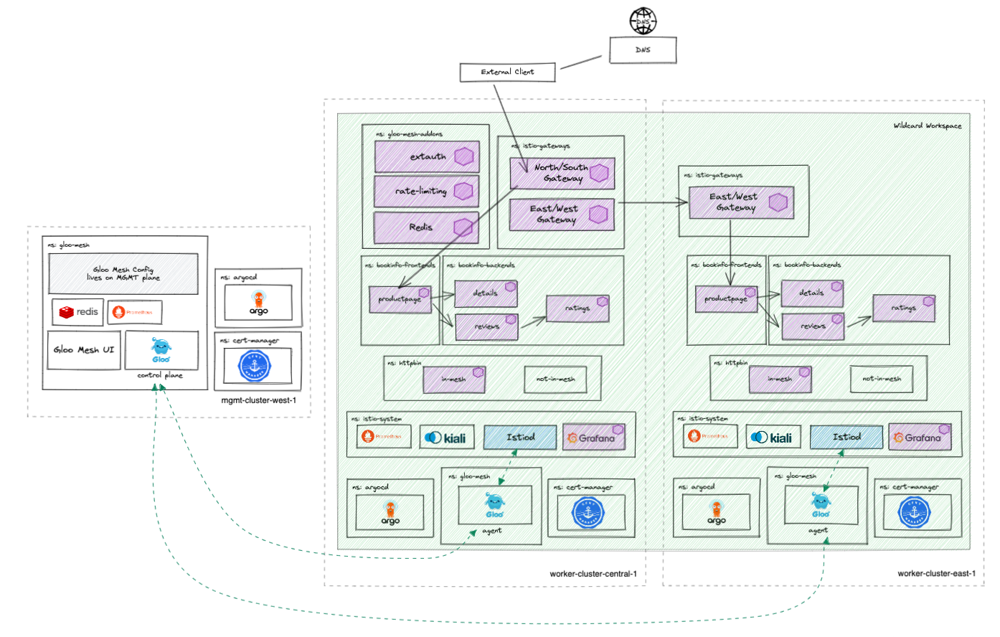
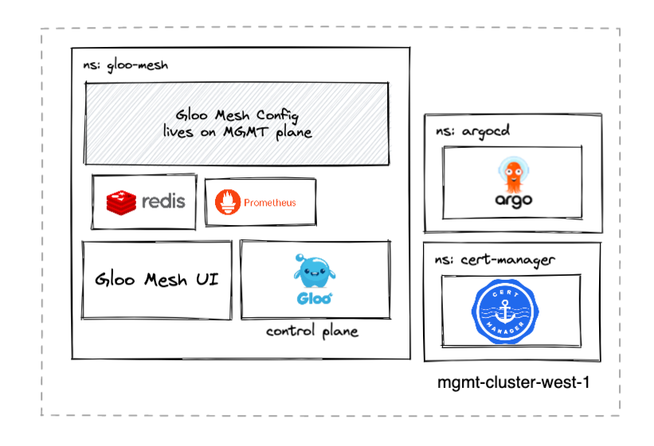

# gloo-mesh-demo-aoa

## version 2.1.0-beta23
This repo provides a multitenant capable GitOps workflow structure that can be forked and used to demonstrate the deployment and configuration of a multi-cluster mesh demo as code using the Argo CD app-of-apps pattern.

# Prerequisites 
- 1 Kubernetes Cluster
    - This demo has been tested on 1x `n2-standard-4` (gke), `m5.xlarge` (aws), or `Standard_DS3_v2` (azure) instance for `mgmt` cluster

# High Level Architecture


# What this repo deploys


# Getting Started
Run:
```
./deploy.sh $LICENSE_KEY $cluster_context        # deploys on mgmt cluster by default if no input
```
The script will prompt you for a Gloo Mesh Enterprise license key if not provided as an input parameter

Note:
- By default, the script will deploy into a cluster context named `mgmt`if not passed in
- Context parameters can be changed from defaults by passing in variables in the `deploy.sh` A check is done to ensure that the defined contexts exist before proceeding with the installation. Note that the character `_` is an invalid value if you are replacing default contexts
- Although you may change the contexts where apps are deployed as describe above, the Gloo Mesh and Istio cluster names will remain stable references (i.e. `mgmt`, `cluster1`, and `cluster2`)

# App of Apps Explained
The app-of-apps pattern uses a generic Argo Application to sync all manifests in a particular Git directory, rather than directly point to a Kustomize, YAML, or Helm configuration. Anything pushed into the `environment/<overlay>/active` directory is deployed by it's corresponding app-of-app
```
environment
├── wave-1
│   ├── active
│   │   ├── argocd-ns.yaml
│   │   ├── bookinfo-backends-ns.yaml
│   │   ├── bookinfo-frontends-ns.yaml
│   │   ├── cert-manager-cacerts.yaml
│   │   ├── cert-manager-ns.yaml
│   │   ├── gloo-mesh-addons-ns.yaml
│   │   ├── gloo-mesh-ns.yaml
│   │   ├── gloo-mesh-relay-identity-token-secret.yaml
│   │   ├── gloo-mesh-relay-root-ca.yaml
│   │   ├── httpbin-ns.yaml
│   │   ├── istio-gateways-ns.yaml
│   │   └── istio-system-ns.yaml
│   ├── init.sh
│   ├── non-active
│   │   ├── 1.7-cert-manager-crds.yaml
│   │   ├── cert-manager-cacerts.yaml
│   │   ├── cert-manager-ns.yaml
│   │   └── relay-forwarding-identity-token-secret.yaml
│   ├── test.sh
│   └── wave-1-aoa.yaml
├── wave-2
│   ├── active
│   │   └── cert-manager.yaml
│   ├── init.sh
│   ├── test.sh
│   └── wave-2-aoa.yaml
├── wave-3
│   ├── active
│   │   ├── gateway-cert.yaml
│   │   ├── grafana.yaml
│   │   ├── istio-base.yaml
│   │   ├── istio-ingressgateway.yaml
│   │   ├── istiod-1-13.yaml
│   │   ├── kiali.yaml
│   │   └── prometheus.yaml
│   ├── init.sh
│   ├── test.sh
│   └── wave-3-aoa.yaml
├── wave-4
│   ├── active
│   │   ├── cert-manager-clusterissuer.yaml
│   │   ├── cert-manager-issuer.yaml
│   │   ├── gloo-mesh-addons.yaml
│   │   ├── gloo-mesh-agent-cert.yaml
│   │   ├── gloo-mesh-agent.yaml
│   │   ├── gloo-mesh-cert.yaml
│   │   ├── gloo-mesh-ee-helm-disableca.yaml
│   │   └── gloo-mesh-relay-tls-signing-cert.yaml
│   ├── init.sh
│   ├── test.sh
│   └── wave-4-aoa.yaml
├── wave-5
│   ├── active
│   │   ├── bookinfo-backends-dyaml.yaml
│   │   └── bookinfo-frontends-dyaml.yaml
│   ├── init.sh
│   ├── non-active
│   │   └── bookinfo-cert.yaml
│   ├── test.sh
│   └── wave-5-aoa.yaml
├── wave-6
│   ├── active
│   │   ├── httpbin-in-mesh.yaml
│   │   └── httpbin-not-in-mesh.yaml
│   ├── init.sh
│   ├── test.sh
│   └── wave-6-aoa.yaml
└── wave-7
    ├── active
    │   ├── argocd-mgmt-rt-80.yaml
    │   ├── bookinfo-ratelimit-transformationfilter.yaml
    │   ├── bookinfo-ratelimitclientconfig.yaml
    │   ├── bookinfo-ratelimitpolicy.yaml
    │   ├── bookinfo-ratelimitserverconfig.yaml
    │   ├── bookinfo-ratelimitserversettings.yaml
    │   ├── bookinfo-rt.yaml
    │   ├── bookinfo-wafpolicy-log4shell.yaml
    │   ├── bookinfo-workspace.yaml
    │   ├── bookinfo-workspacesettings.yaml
    │   ├── gloo-mesh-admin-workspace.yaml
    │   ├── gloo-mesh-admin-workspacesettings.yaml
    │   ├── gloo-mesh-gateways-workspace.yaml
    │   ├── gloo-mesh-gateways-workspacesettings.yaml
    │   ├── gloo-mesh-global-workspacesettings.yaml
    │   ├── gloo-mesh-mgmt-kubernetescluster.yaml
    │   ├── gloo-mesh-mgmt-virtualgateway-443.yaml
    │   ├── gloo-mesh-mgmt-virtualgateway-80.yaml
    │   ├── gloo-mesh-ui-rt-443.yaml
    │   ├── grafana-rt-443.yaml
    │   ├── httpbin-ratelimit-transformationpolicy.yaml
    │   ├── httpbin-ratelimitclientconfig.yaml
    │   ├── httpbin-ratelimitpolicy.yaml
    │   ├── httpbin-ratelimitserverconfig.yaml
    │   ├── httpbin-ratelimitserversettings.yaml
    │   ├── httpbin-rt-443.yaml
    │   ├── httpbin-rt-80.yaml
    │   ├── httpbin-wafpolicy-log4shell.yaml
    │   ├── httpbin-workspace.yaml
    │   └── httpbin-workspacesettings.yaml
    ├── init.sh
    ├── test.sh
    └── wave-7-aoa.yaml
```

# forking this repo
Fork this repo and run the script below to your GitHub username if owning the control over pushing/pulling into the repo is desirable
```
cd tools/
./replace-github-username.sh <github_username>
```
Now you can push new manifests into the corresponding `environments` directories in your fork to sync them using Argo CD
